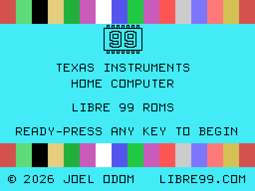
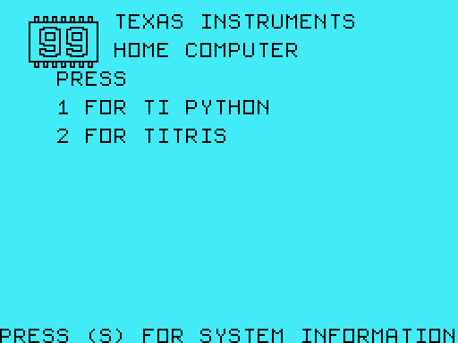
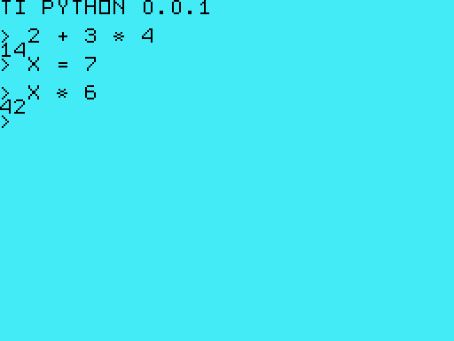
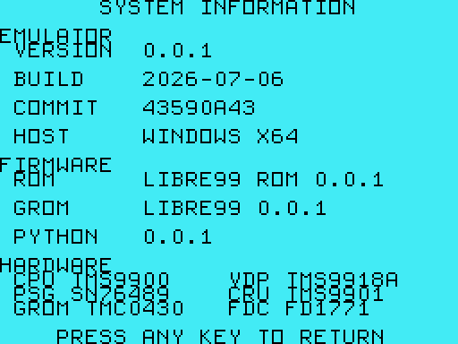
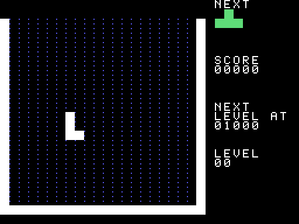
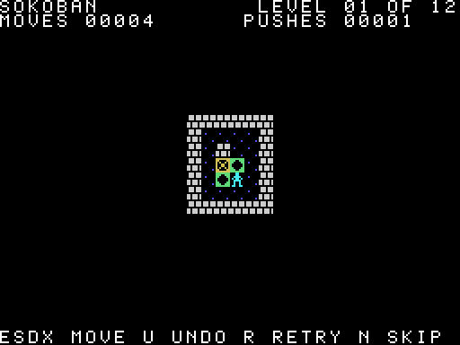
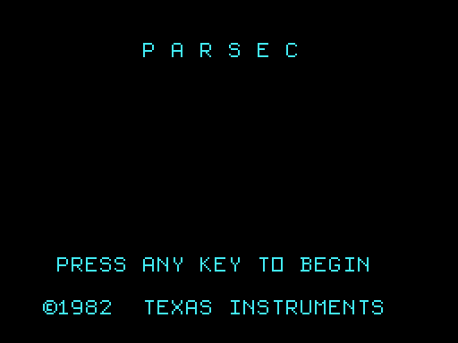
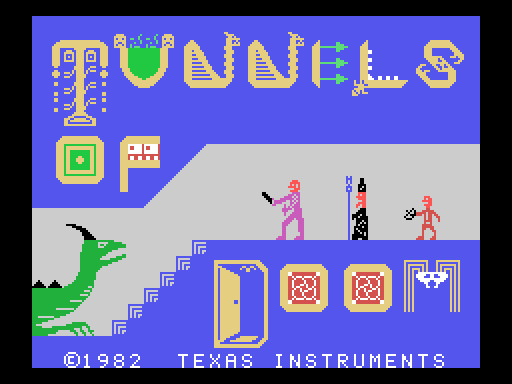

# Libre99

A cycle-aware **Texas Instruments TI-99/4A** home-computer emulator in pure
Rust — together with the toolchain of a complete retro-computing platform: a
from-scratch **TMS9900 assembler**, a **GPL toolchain**, an original
**clean-room console firmware** (booted by default), original **Titris** and
**Sokoban** cartridges built end-to-end with the project's own tools, and a
book in progress about programming the machine.

<p align="center">
  
</p>

The emulator models the real chips — the TMS9900 CPU, TMS9918A video processor,
SN76489 sound generator, TMC0430 GROMs, the TMS9901/CRU keyboard interface, and
the TI Disk Controller (FD1771) — and boots real console firmware on them, so
the console's own GPL interpreter draws the title screen and runs cartridges.
Nothing of the TI operating system is reimplemented on the host: get the chips
right, and the firmware does the rest.

## Highlights

- **Faithful chip emulation, verified.** Beam-accurate scanline video
  rendering, hardware-true GROM prefetch semantics, port-aware wait-state
  timing, the TI noise LFSR — cross-checked against Classic99 (the
  hardware-verified reference emulator) and guarded by **500+ tests** across
  the workspace. When a subtle behavior was wrong, the fix shipped with a
  regression test and a written root-cause analysis.
- **Original clean-room firmware, booted by default.** The console ROM (the
  TMS9900 kernel + GPL interpreter) and console GROM (title screen, cartridge
  menu, **TI PYTHON**, a system-information screen) were rewritten from
  scratch as original work and differentially verified against the authentic
  images. User-supplied authentic TI firmware is one flag away
  (`--system-rom` / `--system-grom`) — and is still required for TI/Extended
  BASIC ([why](docs/KNOWN-ISSUES.md)).
- **Nothing embedded but our own firmware.** The binary carries zero
  third-party bytes; cartridges (`.ctg`) and disks (`.dsk`) load at run time
  from your own files — the command line or the system file chooser (`F9`).
- **A complete author-to-screen toolchain.** `libre99asm` assembles
  Editor/Assembler-dialect TMS9900 source into bootable `.ctg` cartridges
  (`--cartridge <path>` closes the loop), `libre99gpl` builds GPL firmware, and
  two original games prove the pipeline: **Titris** (falling blocks) and
  **Sokoban** (the warehouse-keeper puzzle, with twelve credited Microban
  levels) — both gameplay-tested end to end on the emulated console.
- **A pleasant desktop app.** On-screen help overlay with a pictured TI
  keyboard, layout-independent typing (QWERTY/Dvorak/AZERTY all just work),
  native file-chooser media mounting, save state with auto-save/resume,
  screenshots, pause/frame-advance/fast-forward, and a live CPU inspector —
  the overlays drawn by the app itself, no GUI toolkit.

## Screenshots

The clean-room firmware and original content:

| Selection menu | TI PYTHON | System information |
|---|---|---|
|  |  |  |

| Titris (original cartridge, built with `libre99asm`) | Sokoban (original cartridge, built with `libre99asm`) |
|---|---|
|  |  |

Third-party titles running on the emulator (historical screenshots — the
commercial cartridge images themselves are **not** part of this repository;
media loads at run time from user-supplied files):

| Parsec | Tunnels of Doom |
|---|---|
|  |  |

Regenerate the our-titles gallery any time with
`cargo run -p libre99-gpl --example readme_gallery` (the two third-party shots
above are static and no longer regenerated).

## Quickstart

You need a **Rust toolchain** (stable, edition 2021+) with Cargo — nothing
else. The clean-room firmware is baked into the binary; cartridges and disks
are files you mount at run time.

```bash
# Boots the bare console to the master title screen.
cargo run --release -p libre99-app
```

A window opens at the master title screen. **Just type** — the keyboard starts
in character mode, so your keystrokes produce the same characters on the TI
regardless of host layout. Press `F9` to mount a cartridge or disk with your
system's file chooser. Useful keys from the start:

| Key | Action |
|---|---|
| `F1` / `Esc` | Help overlay — five tabs, including the full TI keyboard reference |
| `F9` | Mount media — pick any `.ctg` cartridge or `.dsk` disk image |
| `F5` | Reset the console |
| `F10` | Pause / resume |
| `Cmd`+`Q` (macOS) / `Alt`+`F4` | Quit — the session auto-saves and resumes on next launch |

The complete manual — every hotkey, the keyboard modes, the command line,
preferences, save states, file locations — is
**[docs/USER-GUIDE.md](docs/USER-GUIDE.md)**.

```bash
# A few common variations:
cargo run --release -p libre99-app -- --cartridge my.ctg          # mount a cartridge file
cargo run --release -p libre99-app -- --disk vol.dsk              # insert a disk into DSK1
cargo run --release -p libre99-app -- --cartridge build/game.ctg  # run your own libre99asm build

# Boot user-supplied authentic TI firmware instead of the clean-room default
# (required for TI BASIC / Extended BASIC):
cargo run --release -p libre99-app -- --system-rom path/to/994aROM.Bin --system-grom path/to/994AGROM.Bin
```

## The pieces

| Piece | What it is | Docs |
|---|---|---|
| `crates/libre99-core` | The emulator core: every chip, the console bus, save states. Pure `std`, **zero third-party dependencies**, `#![forbid(unsafe_code)]`. | [docs/ARCHITECTURE.md](docs/ARCHITECTURE.md) |
| `crates/libre99-app` | The desktop app: window, audio, input, overlays, media mounting, config, logging. | [docs/USER-GUIDE.md](docs/USER-GUIDE.md) |
| `crates/libre99-asm` | `libre99asm` — a complete two-pass TMS9900 assembler + `.ctg` cartridge packager + disassembler. | [assembler/ASSEMBLER.md](assembler/ASSEMBLER.md) |
| `crates/libre99-gpl` | `libre99gpl` — GPL (Graphics Programming Language) assembler/disassembler and the console-GROM build + verification harness. | [original-content/system-roms/grom/README.md](original-content/system-roms/grom/README.md) |
| `original-content/system-roms` | The clean-room console ROM + GROM rewrite (Libre99): original firmware, differentially verified, booted by default. | [original-content/system-roms/README.md](original-content/system-roms/README.md) |
| `original-content/cartridges/titris` | Titris, an original cartridge authored with the project's own assembler. | [its README](original-content/cartridges/titris/README.md) |
| `original-content/cartridges/sokoban` | Sokoban, a second original cartridge — the classic puzzle with twelve credited Microban levels. | [its README](original-content/cartridges/sokoban/README.md) |
| `docs/ti99book` | *Programming the TI-99/4A* — a book manuscript in progress, founded on this project's toolchain. | [its README](docs/ti99book/README.md) |
| `third-party/` | **Git-ignored, maintainer-local** TI firmware and commercial media used only by the differential test suites (absent from a fresh checkout; the public suite skips those tests). | [docs/DEVELOPMENT.md](docs/DEVELOPMENT.md) |

## Documentation

**Using it**

- **[docs/USER-GUIDE.md](docs/USER-GUIDE.md)** — the emulator's complete user
  manual: command line, keyboard, hotkeys, media, save states, preferences,
  logs, limitations.
- **[assembler/ASSEMBLER.md](assembler/ASSEMBLER.md)** — the `libre99asm` user
  guide and TMS9900 assembly-language reference.
- **[docs/KNOWN-ISSUES.md](docs/KNOWN-ISSUES.md)** — behaviors that look like
  bugs but are authentic hardware/firmware behavior, plus genuine open issues.

**Understanding and changing it**

- **[docs/ARCHITECTURE.md](docs/ARCHITECTURE.md)** — the emulated machine, the
  memory map, the crate/module layout, and the run-time data flow.
- **[docs/DEVELOPMENT.md](docs/DEVELOPMENT.md)** — building, testing, project
  conventions, documentation policy, and the licensing/IP checklist.
- **[docs/STATUS.md](docs/STATUS.md)** — where the project stands: what is
  built, verified, and remaining.
- **[docs/ROADMAP.md](docs/ROADMAP.md)** — where it goes next, and the design
  principles that keep features modular.
- **[docs/CROSS-VALIDATION.md](docs/CROSS-VALIDATION.md)** — the plan for
  validating the rewritten firmware outside this emulator.
- **[docs/history/](docs/history/)** — executed plans and dated reports,
  preserved as the project's engineering record.

## Status

The emulator core and desktop app are **complete and playable** (the one open
packaging item is a double-clickable macOS `.app` bundle — run via `cargo run`
for now), the clean-room firmware **boots by default**, and the assembler and
GPL toolchains are **complete**. Detail: [docs/STATUS.md](docs/STATUS.md).

## License and provenance

This project's original work — the emulator, the toolchain, the clean-room
firmware, Titris, and the documentation — is Copyright © 2026 Joel Odom and
licensed under the **Modified MIT License with Commons Clause**
(source-available; the right to sell is reserved): see
**[LICENSE.md](LICENSE.md)**.

**No TI firmware or third-party media is tracked in this repository.** The
authentic TI console/DSR firmware and commercial cartridge/disk images used by
the differential test suites live in a **git-ignored** `third-party/`
directory each maintainer supplies locally; they remain the property of their
respective copyright holders and are never distributed with, or embedded in,
this project (policy in [docs/DEVELOPMENT.md](docs/DEVELOPMENT.md)). This
repository was created 2026-07-06 from an IP-free snapshot of its private
predecessor, so its **history has never contained a proprietary byte** — clean
back to commit 1 ([roadmap](docs/ROADMAP.md)). Hardware references
consulted are credited in [docs/ARCHITECTURE.md](docs/ARCHITECTURE.md) and
[docs/history/PLAN.md](docs/history/PLAN.md).
