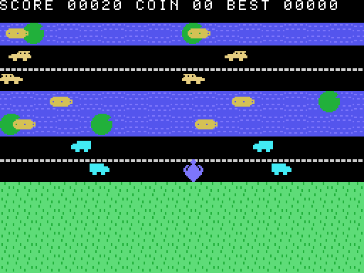

# JAYWALK — an endless-hopper arcade game for the TI-99/4A, in TMS9900 assembly

**Jaywalk** is the third original cartridge in this repository, and the first
built to show off the machine's **arcade** hardware: where
[Titris](../titris/README.md) and [Sokoban](../sokoban/README.md) are
character-graphics puzzle games, Jaywalk is a sprite game — up to two dozen
16×16 hardware sprites moving at independent sub-pixel speeds, with all four
voices of the sound chip working. Every byte was written in TI
Editor/Assembler-style source, assembled by the repo's own `libre99asm`
(`crates/libre99-asm`), and booted on the repo's own emulated console
(`crates/libre99-core`).

The concept is a love letter to the modern **endless hopper** — the genre
Crossy Road popularized in 2014 — rebuilt from scratch for 1981 silicon with
original code, art, name, and sound. (Game mechanics are not copyrightable;
everything expressive here is this project's own.)

<p align="center">
  
</p>

*(The screenshot is generated headlessly by the repo's deterministic gallery
tool — `cargo run -p libre99-gpl --example readme_gallery` — booting this
exact `.ctg` on the clean-room firmware.)*

A fledgling blue jay, too young to fly, sets out north across an endless,
procedurally generated world:

- **Grass** meadows, with bushes that block a hop and coins tucked between.
- **Roads** — one to three lanes wide, sedans and box trucks in both
  directions, faster the farther you go.
- **Rivers** — hop the drifting logs and lily pads, ride a log too long and
  it carries you off the map.
- **Rail lines** — when the crossing signal starts flashing and the bell
  rings, an express is seconds away. It does not brake.
- Coins are worth 25 points; every new lane north is worth 10.
- **Hawks take idle birds.** Stand still too long and you'll hear the
  warning screech; keep dawdling and you're carried off. Keep hopping.

```
   ====== title screen ======       ============= gameplay =============
                                    SCORE 00120 COIN 02 BEST 00470
     J A Y W A L K  (big blocks)    ~~~(pad)~~~[log>~~~~~~[log>~~(pad)~~  river
                                    ==[TRAIN>==============:!:=========  rails
     A TINY JAY VS THE WORLD        .. (o) ..  ..  (o)  .. (25) ..  ..   grass
                                    <car]  - - - - - - - - -   [truck>   road
     PRESS ANY KEY TO PLAY          .. .. .. .. .. ^JAY .. ..  ..  ..    grass
     H OR AID FOR HELP
                                    the camera follows; the world doesn't end

   controls:  E / up-arrow  hop north (scores)    X / down  hop south
              S / left      hop west              D / right hop east
              (the host arrow keys drive TI joystick 1)
              H or AID (FCTN+7) on the title = help
```

## Files in this folder

| File | What it is |
|------|------------|
| `jaywalk.asm` | The complete game source (TMS9900 assembly, ~2500 lines). |
| `jaywalk.ctg` | The compiled cartridge image, ready to mount in the emulator. |
| `README.md` | This document. |

The `.ctg` is committed so you can play immediately without building anything.

## Play it

From the repository root:

```sh
cargo run --release -p libre99-app -- \
    --cartridge original-content/cartridges/jaywalk/jaywalk.ctg
```

On the console's selection screen press **2** (`2 FOR JAYWALK`); the game's
own title screen appears (the jay hopping on its meadow while traffic rolls
by), so **press any key to play** — or **H** (or **AID**, `FCTN`+`7`) for a
help screen with a field guide to the world's glyphs. Then hop:

- **E** or **↑** — north (this is the one that scores)
- **X** or **↓** — south, **S**/**←** west, **D**/**→** east
- One hop per press: sixteen pixels in eight frames, with a wing-spread
  animation and a chirp.

The camera follows you north; falling off the bottom edge is impossible (the
camera never retreats, and south hops stop at the screen edge). The world
mixes harder with distance — every 16 lanes crossed is a difficulty tier:
faster traffic, wider highways and rivers, fewer lily pads. A run ends
squished, swept downriver, under the express, or in a hawk's talons; the
game-over panel names the cause, totals the run (score, coins, lanes,
session best — with a fanfare on a new best), and any key returns to the
title.

## Build it yourself

The assembler ships in this repo, so you can edit `jaywalk.asm` and rebuild:

```sh
cargo run -p libre99-asm -- \
    original-content/cartridges/jaywalk/jaywalk.asm \
    -o original-content/cartridges/jaywalk/jaywalk.ctg
```

(See [assembler/ASSEMBLER.md](../../../assembler/ASSEMBLER.md) for the
language.)

---

## How it works — a tour of the tricks

Titris proved the toolchain; Jaywalk was written to exercise the parts of
the TI-99/4A that a falling-blocks puzzle never touches.

### A 24-sprite world on a 4-per-line chip

Everything that moves is a hardware sprite in **16×16 mode** (VDP R1 bit
`SIZE`): the jay, the hawk, and two objects per visible lane — cars, logs,
or a locomotive and its boxcar. The sprite attribute table is rebuilt in RAM
every frame (`SATBLD`) and blasted to VRAM in one 100-byte write during
vertical blank (`SATFLSH`), a classic double-buffer.

The TMS9918A draws at most **four sprites per scanline**, dropping the
highest-numbered ones. Jaywalk turns that limit into a policy: slots are
assigned bottom-lane-first, so the sprites nearest the player always win and
any drop lands on the farthest, least-noticeable lane. Mid-hop the jay spans
two lanes (its own slot 0 always draws — sprite 0 has top priority), so a
crowded moment can flicker a distant car exactly the way period games do.

Sprites slide **smoothly off both screen edges**: the right side clips
naturally, and the left side uses the **early-clock bit** (bit 7 of the
color byte shifts a sprite 32 px left), so a car eases out of the world
pixel by pixel instead of popping. Positions are **12.4 fixed-point** —
whole pixels in the high twelve bits, sixteenths below — which is how every
lane gets its own speed (a tier-0 river drifts at 4/16 px per frame; a
tier-7 road does 27/16; the express does a flat 4 px).

### An endless world in sixteen lane records

The world is a **ring of sixteen lane records** (16 bytes each) in expansion
RAM: type, direction, speed, a 16-bit bush/lily-pad bitmask, a coin column,
two object positions, and the rail countdown. Eleven lanes are visible; the
generator (`GENLANE`) stays two lanes ahead of the camera and overwrites the
slot that just scrolled off — an infinite world in 256 bytes.

Generation is tuned by a difficulty table (`GENTAB`): a 4-bit roll against
per-tier thresholds picks grass/road/river/rail, types arrive in short
**runs** (multi-lane highways, two-lane rivers), speeds scale with tier, and
grass caps at five bushes so a lane can never wall you out. Coins land on
one lane in four — on roads too, where the 25 points cost real nerve.

### Scrolling a character screen without tearing

The background is Graphics I characters (two rows per lane), so the camera
"scrolls" by repainting all eleven bands. Two touches make it invisible:

1. **The camera moves at hop start**, not hop end — the world snaps 16 px
   the instant the jay leaps, and the 8-frame glide absorbs the jump, so the
   eye reads one continuous motion.
2. The repaint (`DRAWALL`) runs right after vertical blank, **top band
   first, racing the beam downward** — a band paints faster than the beam
   crosses one, so the raster never catches a half-drawn row.

### Animation for free from the VDP's tables

Two whole-screen effects cost almost nothing per frame:

- **The river shimmers** by rewriting the two water glyphs' *patterns*
  (16 bytes) every 16 frames — pattern-table animation; every water cell on
  screen ripples at once.
- **The crossing signal flashes** by rewriting one *color-table* byte — the
  lamp glyph sits alone in its 8-character color group, so one byte turns
  every visible signal red. It idles dim dark-red, flashes bright while the
  bell rings the last second and a half, and holds solid while the train is
  through.

### Four voices, one table-driven driver

The SN76489 gets a tiny per-frame sound driver (`SNDTCK`) with three
independent voices — tone 0, tone 1, noise — each playing a byte stream:
`count, raw chip bytes` per frame, a high-bit count as a rest, zero to end.
Sound effects are therefore pure data (`SFXHOP`, `SFXCOIN`, …): the hop
chirp, the coin's rising pair, the two-voice title jingle, the level-crossing
bell, the two-chime train horn over a noise-channel **rumble** (retriggered
while the train sweeps, self-silencing if it stops), the splash's fading
noise wash, the hawk's descending screech, the game-over sigh, and the
new-best arpeggio. Nothing ever waits on sound; triggering an effect is
storing a pointer.

### The hawk, the coins, the deaths

Idleness is a timer (`HAWKT`) that any hop resets: at six seconds the
screech warns, at eight the hawk commits — swooping from above the HUD,
tracking the jay's column, unavoidable once launched (it *is* the idle
penalty; the warning is your grace). Each death stages its own scene while
the traffic keeps rolling: flattened under the wheel, a white splash ring
that sinks, or carried off the top of the screen in dark-red talons.

### Two 9900 lessons, learned the hard way

Both are documented here because they are the two classic ways TMS9900
assembly bites, and both bit during this game's bring-up:

- **The no-stack trap.** `BL` stores its return in R11, so non-leaf routines
  save R11 somewhere; the convention here (inherited from Titris) is R14.
  `HUDUPD` saved R11 in R14 *and called `DNUM5`, which also saves to R14* —
  it returned into itself forever. The fix is a second save slot (`RET4`),
  and the routine headers now document who saves where.
- **`JLE` is unsigned.** The 9900's `JL/JLE/JH/JHE` compare *logically*;
  only `JLT`/`JGT` are arithmetic. The sprite builder parked every car in
  the world because `CI R0,-16 / JLE` compared x = 132 against 65520.

### Proven by its test suite

`crates/libre99-asm/tests/jaywalk.rs` assembles *this exact source*, boots
the real emulated console, and plays: hops and scoring, camera scroll,
bush blocking, coin pickup, log riding and drowning, lily-pad footing, the
train and its flashing signal, the hawk (and that hopping resets it), each
death's game-over panel, the session best on the title, help via H and AID,
the PSG actually sounding on events, world-generator sanity over a long
march, and a 5,000-frame random-input soak. The gallery screenshot in the
README is produced by the same headless pipeline
(`cargo run -p libre99-gpl --example readme_gallery`).

## Limitations & ideas

It's a demonstration cartridge, so there's room to grow: the jay is a
single-color sprite (a second overlay sprite would give it a white breast),
there's no two-player alternation, the hawk always wins once launched, best
scores don't survive power-off, and the difficulty curve tops out at tier 7.
A pattern-flip for leftward cars' headlights, drifting turtle packs that
submerge, and a day/night palette shift are all small, self-contained
additions on top of the structure above.
